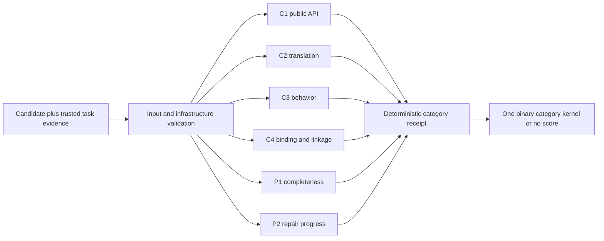

# Fixed26 results

## Results

| Result | Pass@1 | Multi turn with feedback (turn=2) | Trials | Samples |
| --- | ---: | ---: | ---: | ---: |
| [GLM-4.7-Flash base](results/base-fixed26-20260711/) | 0.5/26 mean | 4.5/26 mean | 4 | 104 |
| [Synth v1, epoch 50](results/synth-v1-ep50-9.5-mean/) | 9.5/26 mean | 12/26 mean | 4 | 104 |
| [SFT v5, Aider-format](results/sft-v5-aiderfmt-1117-4trials/) | 6/26 mean | 10.25/26 mean | 4 | 104 |
| [Luna](results/luna-fixed26-20260805/) | 6.25/26 mean | 16.75/26 mean | 4 | 104 |

| Result | Pass@1 SD, range, 95% CI (out of 26) | Multi turn with feedback (turn=2) SD, range, 95% CI (out of 26) | Conditional turn-2 recovery |
| --- | --- | --- | ---: |
| GLM-4.7-Flash base | 0.58; 0-1; 0-1.25 | 1.29; 3-6; 2.25-6.75 | 16/102 (15.7%; CI 7.8-24.8%) |
| Synth v1, epoch 50 | 0.58; 9-10; 5.75-13.5 | 0.82; 11-13; 8.25-15.75 | 10/66 (15.2%; CI 7.4-24.4%) |
| SFT v5, Aider-format | 1.63; 4-8; 3-9.25 | 1.71; 8-12; 7-13.75 | 17/80 (21.2%; CI 11.9-31.6%) |
| Luna | 1.89; 5-9; 3.25-9.5 | 1.5; 15-18; 12.75-20.5 | 42/79 (53.2%; CI 36.8-70%) |

Statistics: [method and summary](results/statistics.md) · [per-task frequencies](results/per_task_success.csv) · [recompute](results/compute_statistics.py)

Synth v1 artifacts: [reproducibility bundle](https://huggingface.co/TokenBender/glm47-synth-v1-reproducibility) · [checkpoint archive](https://huggingface.co/TokenBender/glm47-synth-v1-100ep) · [training dataset](https://huggingface.co/datasets/TokenBender/glm47-synth-v1-dataset) · [evaluation archive](https://huggingface.co/datasets/TokenBender/glm47-synth-v1-fixed26-evals) · [W&B run](https://wandb.ai/ahm-rimer/glm47-aider-cpp-sft/runs/glm47-synth-memorization-v1-100ep-20260731T071000Z)

SFT v5 artifacts: [checkpoint](https://huggingface.co/TokenBender/glm47-aider-sft-v5-aiderfmt-1117-3ep/tree/5d06951941a30939920fb2b7558aa95085531d52) · [training dataset](https://huggingface.co/datasets/TokenBender/glm47-aider-posttraining-data/blob/6ef50c6fd1aca637c3df2df00c9aab4120140797/datasets/aiderfmt-api-contracts-20260727/sft/sft-v5-aiderfmt-1117-api-contracts.jsonl) · [evaluation evidence](https://huggingface.co/datasets/TokenBender/glm47-aider-fixed26-responses/tree/2397232ab6476b414a7af99d9ee6cfe45a856c86/evals/sft-v5-aiderfmt-1117-fixed26contract-pass8-20260727)

## How to reproduce

```bash
cd results/base-fixed26-20260711/reproduction
export OPENAI_API_BASE=http://127.0.0.1:8000/v1
export OPENAI_API_KEY=local-eval
./run.sh
```

```bash
cd results/synth-v1-ep50-9.5-mean/reproduction
./run.sh
```

```bash
cd results/sft-v5-aiderfmt-1117-4trials/reproduction
./run.sh
```

```bash
cd results/luna-fixed26-20260805/reproduction
export OPENROUTER_API_KEY=...
./run.sh
```

## Independent semantic verifier engines

The package includes independently designed, category-local verifier engines for:

- C1: public API and interface correctness
- C2: implementation translation correctness
- C3: functional and behavioral correctness
- C4: declaration/definition binding, completeness, and linkage
- P1: generation completeness
- P2: repair progress across attempts

Each category has exactly one reward-bearing verifier. A semantic verifier returns only
`-1` (fail) or `+1` (pass), so `S_category = v_category`. Infrastructure, malformed-input,
workspace, contract, and ambiguous-attribution dispositions are unscored. Compiler,
parser, linker, provenance, sandbox, and history checks used only as attribution evidence
never emit reward.



C1, C2, and C4 task integration requires a pinned C++17 compiler profile; C1 may also
require a GNU-compatible `nm`. The Python parser dependencies are pinned in
`pyproject.toml` and `uv.lock`. Run the independent verifier suite with:

```bash
uv sync --extra dev --frozen
uv run --frozen pytest -q \
  tests/test_cpp_c1.py tests/test_cpp_c2.py tests/test_cpp_c3.py \
  tests/test_cpp_c4.py tests/test_p1.py tests/test_p2.py \
  tests/test_verifier_integration_contract.py
```

This layer defines verifier engines and their receipt boundaries. It does not invent an
authoritative Crypto Square contract, behavioral oracle, production sandbox attestation,
generation-termination transport, attempt-history transport, or trainer receipt adapter;
those inputs must be supplied by the eventual task integration.
